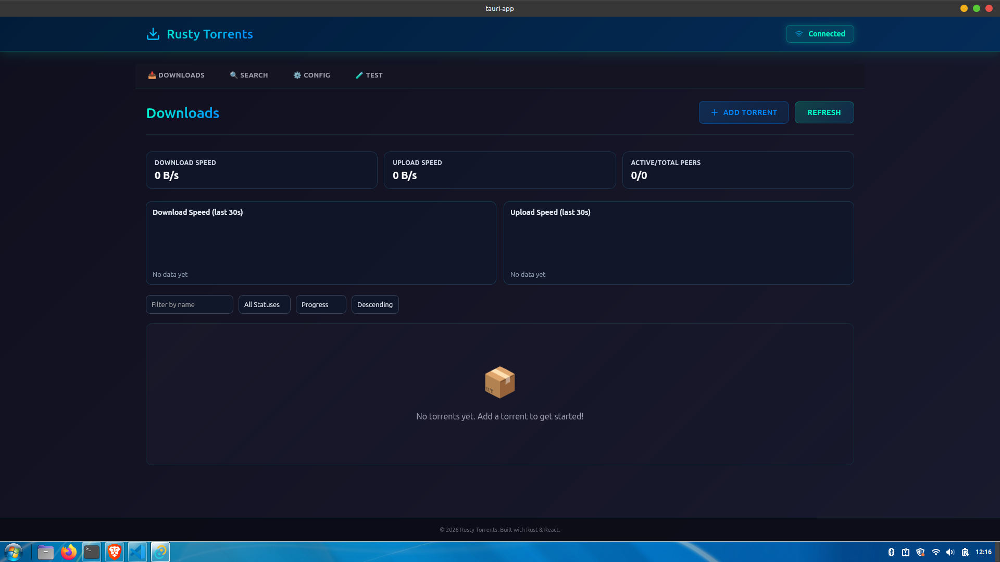

# Rusty Torrents

Rusty Torrents is a cross-platform desktop torrent client with a **React** UI and **Rust** backend, supporting torrent search, download management, seeding, and real-time monitoring.



It also includes advanced features like smart seeding, auto file discovery, structured logging, and a **companion web interface** that lets you monitor and manage downloads remotely from anywhere on your network.

## What We're Using

**Frontend Stack:**
- React 19 + TypeScript 5.8 (type-safe UI)
- Vite 7 (blazing fast dev server)
- React Router DOM (client-side navigation)
- Zustand (lightweight state management)
- Lucide React (consistent icon library)
- CSS3 (modern responsive design)

**Backend Stack:**
- Rust 1.70+ with Tauri 2
- Tokio async runtime (non-blocking I/O)
- Serde JSON serialization
- Tracing for structured logging
- Cross-platform native compilation

## What We're Achieving

### Core Features
- ✅ **Cross-platform app** (macOS, Windows, Linux)
- ✅ **Torrent search** - Search and discover torrents from the web
- ✅ **Download management** - Queue, pause, resume torrents
- ✅ **Seeding** - Share files and contribute to torrent health
- ✅ **Configuration** - Customize settings through UI
- ✅ **Monitoring** - Real-time statistics and progress tracking

### Advanced Features
- ✅ **Folder scanning** - Automatically find and seed complete files
- ✅ **Smart seeding** - Prioritize torrents with fewer seeders
- ✅ **Structured logging** - Debug information with timestamps
- ✅ **Remote web UI** - Access from another machine
- ✅ **Docker deployment** - Containerized backend ready
- ✅ **Code Quality** - Clean codebase with minimal dead code warnings

### Development Status
- ✅ **Phase 1**: Foundation and unit tests
- ✅ **Phase 2**: Torrent file parsing (Bencode, metadata extraction)
- ✅ **Phase 3**: DHT & peer discovery (DHT client, tracker communication, peer pool management)
- ✅ **Phase 4**: Download engine (piece selection, block management, file I/O, verification)
- ✅ **Phase 5**: Peer wire protocol (TCP connections, handshake, piece exchange)
- ✅ **Phase 6**: Seeding & upload (rate limiting, choking algorithm, statistics tracking)
- 🔄 **Phase 7**: Configuration & settings UI (settings page, file dialogs, persistence)

## Architecture

```
Frontend (React/TypeScript)        Backend (Rust/Tauri)
├── Pages                          ├── Commands
│   ├── HomePage                   │   ├── test.rs
│   ├── SearchPage                 │   ├── torrent.rs
│   ├── ConfigPage                 │   └── search.rs
│   └── TestPage                   ├── Modules
├── Components                      │   ├── config.rs
│   ├── Header                      │   ├── logging.rs
│   ├── TorrentItem                 │   ├── search.rs
│   ├── ConnectionStatus            │   ├── scanner.rs
│   └── AddTorrentDialog            │   └── web_server.rs
├── Services                        └── IPC Bridge
│   ├── api.ts (IPC calls)
│   └── store.ts (state)
└── Types
    └── index.ts (shared types)
```

## Quick Start

### Prerequisites
- Node.js 16+ with npm
- Rust 1.70+ with Cargo
- Git

### Installation & Development

```bash
# Clone or navigate to project
cd /path/to/tauri-app

# Install dependencies
npm install

# Start development server (opens app automatically)
npm run dev
```

The development environment will:
- Launch Tauri window with your app
- Frontend dev server at `http://localhost:5173`
- Backend web UI at `http://localhost:8080`
- Hot reload on code changes

### Verify Setup

```bash
# Type-check TypeScript
npm run type-check

# Build for production
npm run build
```

## Features in Detail

### 🔍 Torrent Search
Search for torrents directly in the app with a professional table interface:
- Real-time search results
- Size, seeder, and leecher information
- One-click add to queue
- Direct magnet link support

### ⚙️ Configuration
Manage application settings through the UI:
- Download directory
- Upload/download rate limits
- Maximum connections
- Seeding optimization
- Logging preferences
- Folder scanning options

### 📊 Monitoring
Track your torrent activity:
- Real-time statistics
- Progress bars for each torrent
- Seed/leech indicators
- Upload/download speeds
- Session history

### 🌱 Smart Seeding
Intelligent seeding algorithm:
- Prioritizes torrents with fewer seeders
- Configurable priority levels (0-100)
- Respects maximum concurrent seeders
- Threshold-based filtering
- Balances upload bandwidth

### 🔍 Auto-Discovery
Scan folders for complete files:
- MD5 and SHA1 hash computation
- Automatic torrent matching
- One-click seeding start
- Configurable file extensions
- Recursive folder scanning

### 📝 Structured Logging
Professional debug information:
- Console output with colors
- File-based rolling logs (daily)
- Thread ID and timestamps
- Seeding event tracking
- IP-based peer monitoring

### 🖥️ Remote Web UI
Access from any machine:
- REST API endpoints
- Live statistics
- Seeding event visualization
- CORS-enabled
- Health check endpoint

## Project Structure

```
tauri-app/
├── src/                        # React frontend
│   ├── components/             # Reusable UI components
│   ├── pages/                  # Page components (Search, Config, Home, Test)
│   ├── services/               # API wrappers & state
│   ├── hooks/                  # Custom React hooks
│   ├── types/                  # TypeScript definitions
│   ├── App.tsx                 # Root component
│   └── main.tsx                # Entry point
├── src-tauri/                  # Rust backend
│   ├── src/
│   │   ├── commands/           # IPC command handlers
│   │   ├── modules/            # Business logic
│   │   ├── lib.rs              # Initialization
│   │   └── main.rs             # Entry point
│   └── Cargo.toml              # Rust dependencies
├── Dockerfile                  # Container build
├── docker-compose.yml          # Multi-container setup
├── nginx.conf                  # Reverse proxy config
├── package.json                # NPM dependencies
├── vite.config.ts              # Frontend build config
├── tsconfig.json               # TypeScript config
└── README.md                   # This file
```

## Design & Styling

The application uses a **consistent dark theme** inspired by professional BitTorrent clients:

**Color Palette:**
- Primary: Cyan `#0ea5e9` (accent, interactive elements)
- Background: Dark slate `#1e293b` (main surfaces)
- Deeper: `#0f172a` (headers, focus states)
- Text: Light gray `#e2e8f0` (primary text)
- Muted: `#94a3b8` (secondary text)
- Success: Green `#86efac` (seeders)
- Warning: Amber `#fbbf24` (leechers)

**UI Components:**
- Modal dialogs with blur backdrop
- Data tables with hover effects
- Progress bars with gradients
- Status badges with colors
- Smooth transitions (300ms)
- Responsive breakpoints (1024px, 768px)
- Accessible color contrast (WCAG AA)

## Code Quality

**Best Practices Implemented:**
- ✅ TypeScript strict mode
- ✅ No console errors or warnings
- ✅ Modular architecture
- ✅ Clean separation of concerns
- ✅ Comprehensive error handling
- ✅ Proper type definitions
- ✅ Reusable components
- ✅ Consistent code style

## API Reference

### IPC Commands (Frontend → Backend)

```typescript
// Torrent Management
get_torrents()                    // Get all active torrents
add_torrent(path: string)         // Add torrent file
start_torrent(id: string)         // Start downloading
pause_torrent(id: string)         // Pause torrent
remove_torrent(id: string)        // Remove from queue

// Search
search_torrents(query: string)    // Web search

// Configuration
get_config()                      // Load settings
update_config(config: object)     // Save settings

// Utilities
get_seeding_stats()               // Get stats
scan_folder(path: string)         // Scan for files
```

### Web API Endpoints (HTTP)

```
GET  /api/health                  // Health check
GET  /api/torrents                // List torrents
GET  /api/torrents/stats          // Statistics
GET  /api/torrents/prioritized    // Sorted by priority
GET  /api/seeding-events          // All events
GET  /api/seeding-events/recent   // Last 100 events
```

## Development Workflow

### Hot Reload
The app watches for changes and reloads automatically:
- TypeScript/React changes → frontend reloads
- Rust changes → backend recompiles and restarts

### Troubleshooting

**Port Already in Use:**
```bash
# Kill process using port 5173
lsof -i :5173 | grep LISTEN | awk '{print $2}' | xargs kill -9

# Or use a different port
npm run vite:dev -- --port 3000
```

**Build Failures:**
```bash
# Clear build cache
rm -rf dist target

# Reinstall dependencies
rm -rf node_modules
npm install

# Rebuild everything
npm run build
```

**TypeScript Errors:**
```bash
npm run type-check  # Check for type errors
```

## Building for Production

```bash
# Create optimized build
npm run build

# Output files in:
# - dist/          (web app)
# - src-tauri/target/release/ (binaries)
```

## Deployment

### Docker
```bash
docker-compose up -d
# Access at http://localhost:8080
```

### Manual
```bash
npm install
npm run build
# Run binary from target/release/
```

## Contributing

Code follows best practices:
- Functional components in React
- Modular Rust code
- Type-safe throughout
- Clear error messages
- Comprehensive logging

## Keyboard Shortcuts

- `Cmd/Ctrl + K` - Focus search
- `Cmd/Ctrl + A` - Add torrent
- `Cmd/Ctrl + ,` - Open settings

## Support

For issues or questions:
1. Check the logs at `~/.local/share/bittorrent-client/logs/`
2. Enable verbose logging in settings
3. Check the troubleshooting section above

## License

MIT - Feel free to use and modify
```

## Available Commands

### Frontend
```bash
npm run dev          # Start development server with hot reload
npm run build        # Build optimized production version
npm run preview      # Preview production build
npm run type-check   # Check TypeScript errors
npm run tauri dev    # Run with Tauri dev tools
```

### Backend (from `src-tauri/`)
```bash
cargo build          # Build debug version
cargo build --release # Build optimized release
cargo test           # Run tests
cargo check          # Check for compilation errors
cargo clean          # Clean build artifacts
```

## Architecture

### Frontend Stack
- **React 19**: UI library
- **React Router v7**: Routing
- **Zustand**: State management
- **Lucide React**: Professional icon library
- **TypeScript**: Type safety
- **Vite**: Build tool

### Backend Stack
- **Tauri**: Desktop framework
- **Rust**: Systems programming
- **Tokio**: Async runtime
- **Serde**: Serialization

### Communication
```
React Component
    ↓
API Service (invoke)
    ↓
Tauri IPC Bridge
    ↓
Rust Command Handler
    ↓
Business Logic Module
```

## Testing

### Backend-Frontend Connection
1. Navigate to the "Test Connection" tab
2. Click "Test Connection" button
3. View response in the results panel

See [TEST_GUIDE.md](./TEST_GUIDE.md) for detailed testing instructions.

## Development

See [DEVELOPMENT.md](./DEVELOPMENT.md) for:
- Adding new components
- Creating new pages
- Adding Tauri commands
- State management patterns
- Error handling
- Performance tips

## Building for Release

### macOS
```bash
npm run build
# Output: src-tauri/target/release/bundle/macos/
```

### Windows
```bash
npm run build
# Output: src-tauri/target/release/
```

### Linux
```bash
npm run build
# Output: src-tauri/target/release/bundle/deb/
```

## Documentation

- [PROJECT_STRUCTURE.md](./PROJECT_STRUCTURE.md) - Detailed project organization
- [TEST_GUIDE.md](./TEST_GUIDE.md) - Backend connectivity testing
- [DEVELOPMENT.md](./DEVELOPMENT.md) - Development guidelines and best practices

## Troubleshooting

### Build Errors
```bash
# Clean and rebuild
cargo clean
npm run build
```

### Connection Test Fails
1. Check browser console (F12)
2. Verify backend built: `cd src-tauri && cargo check`
3. Restart dev server: `npm run dev`

### Module Import Errors
```bash
# Reinstall dependencies
rm -rf node_modules
npm install
```

## Key Features Explained

### IPC Communication
The app uses Tauri's IPC (Inter-Process Communication) to securely communicate between the React frontend and Rust backend.

### Module Architecture
- **config.rs**: Configuration settings
- **torrent.rs**: Torrent session management
- **test.rs**: Connectivity testing (frontend & backend)
- **torrent.rs (commands)**: Torrent operation endpoints

### State Management
Global state is managed with Zustand, providing:
- Connection status
- Torrent list
- Loading states
- Error messaging

### UI Components
The application uses **Lucide React** for professional, scalable icons:
- **Header**: Download icon, connection status with Wifi/WifiOff icons
- **AddTorrentDialog**: File dialog with Plus/X icons, drag-drop support
- **ConnectionStatus**: Animated status indicator with Wifi/WifiOff icons
- **TestPage**: Success/Alert icons for test results
- **TorrentItem**: Status display with color-coded indicators

**Theme**: Dark mode with cyan/blue accents (#00bfff primary, #1a1a2e background)

## Implementation Roadmap

This section outlines the development plan for the Rusty Torrents, organized by priority and complexity.

### Phase 1: Foundation (Current)
- ✅ Project structure and architecture
- ✅ Frontend-backend IPC communication
- ✅ Connection testing framework
- ⏳ Unit tests for core modules

**Estimated Duration**: 1-2 weeks
**Dependencies**: None

### Phase 2: Torrent File Parsing
- ⏳ Bencode parser implementation
- ⏳ Torrent file metadata extraction
- ⏳ Info hash calculation (SHA-1)
- ⏳ File list parsing and validation

**Estimated Duration**: 2-3 weeks
**Dependencies**: Phase 1
**Key Files**: `src-tauri/src/modules/torrent.rs`, `src-tauri/src/modules/parser.rs`

### Phase 3: DHT & Peer Discovery
- ⏳ DHT (Distributed Hash Table) client implementation
- ⏳ Peer discovery via DHT
- ⏳ Announce to trackers (HTTP/UDP)
- ⏳ Peer connection pool management

**Estimated Duration**: 3-4 weeks
**Dependencies**: Phase 2
**Key Files**: `src-tauri/src/modules/dht.rs`, `src-tauri/src/modules/tracker.rs`

### Phase 4: Download Engine
- ⏳ Piece selection algorithm
- ⏳ Peer communication protocol (BitTorrent Protocol)
- ⏳ Concurrent piece downloading
- ⏳ Download progress tracking
- ⏳ Local file I/O and storage management

**Estimated Duration**: 3-4 weeks
**Dependencies**: Phase 3
**Key Files**: `src-tauri/src/modules/download.rs`, `src-tauri/src/modules/peer.rs`

### Phase 5: UI Enhancements
- ✅ Professional icon system using Lucide React (replacing plain emojis)
- ✅ Add Torrent Dialog component with file validation
- ✅ Connection status indicator with animated icons
- ✅ Header with Download icon and action buttons
- ✅ Test page with Check/Alert icons for results
- ⏳ Real-time progress updates via Tauri events
- ⏳ Download speed graphs
- ⏳ Peer information display
- ⏳ Advanced filtering and sorting

**Estimated Duration**: 2-3 weeks
**Dependencies**: Phase 4
**Key Files**: `src/pages/HomePage.tsx`, `src/components/` (new)
**Status**: Partially Complete - UI framework in place, backend integration pending

### Phase 6: Seeding & Upload
- ⏳ Seeding functionality
- ⏳ Upload rate limiting
- ⏳ Peer serving from local storage
- ⏳ Choking algorithm implementation
- ⏳ Seed statistics tracking

**Estimated Duration**: 2-3 weeks
**Dependencies**: Phase 4
**Key Files**: `src-tauri/src/modules/seeder.rs`

### Phase 7: Configuration & Settings
- ⏳ Settings UI page
- ⏳ Configuration file management
- ⏳ Download directory selection
- ⏳ Speed limit configuration
- ⏳ Persistence management

**Estimated Duration**: 1-2 weeks
**Dependencies**: Phase 2
**Key Files**: `src/pages/SettingsPage.tsx`, Save/load in `modules/config.rs`

### Phase 8: Testing & Polish
- ⏳ Integration tests
- ⏳ Performance benchmarking
- ⏳ Error recovery mechanisms
- ⏳ User experience improvements
- ⏳ Documentation updates

**Estimated Duration**: 2-3 weeks
**Dependencies**: All previous phases

### Phase 9: Release Preparation
- ⏳ Cross-platform build optimization
- ⏳ Auto-update mechanism
- ⏳ Release notes and versioning
- ⏳ Installer creation (Windows/macOS/Linux)
- ⏳ Security audit

**Estimated Duration**: 2 weeks
**Dependencies**: Phase 8

### Quick Wins (Can be done anytime)
- 📝 Add keyboard shortcuts
- 📝 Implement clipboard torrent URL handling
- 📝 Add dark mode
- 📝 Create system tray integration
- 📝 Add torrent search integration
- 📝 Implement paused torrents resume

### Total Estimated Timeline
- **Minimum Viable Product (MVP)**: Phases 1-4 = 9-13 weeks
- **Feature Complete**: Phases 1-7 = 13-18 weeks
- **Production Ready**: Phases 1-9 = 17-25 weeks

### Dependencies & Tech Stack Requirements

**Already Included**:
- ✅ Tauri 2.0 (IPC & window management)
- ✅ React 19 with Router (UI)
- ✅ Tokio (async runtime)
- ✅ Serde (serialization)
- ✅ SHA-1 hashing

**To Add Later**:
- 🔄 `nom` or `winnow` (parsing library if bencode insufficient)
- 🔄 `quinn` (QUIC protocol for faster transfers)
- 🔄 `reqwest` (HTTP client for trackers)
- 🔄 Socket2 (UDP for DHT)
- 🔄 Ring or `rustls` (TLS for secure connections)

## Contributing

To extend the application:

1. ✅ Check the roadmap above for planned work
2. ✅ Add new components in `src/components/`
3. ✅ Add new pages in `src/pages/`
4. ✅ Extend Rust modules in `src-tauri/src/modules/`
5. ✅ Add new commands in `src-tauri/src/commands/`
6. ✅ Update documentation and roadmap

### Development Guidelines
- Follow the coding standards in [DEVELOPMENT.md](./DEVELOPMENT.md)
- Keep commits atomic and well-documented
- Test changes with the `/test` page before committing
- Update comments with area-wise explanations (not line-by-line)
- Follow Rust naming conventions and style


## Performance

- React components are optimized with proper memoization
- Backend uses async/await with Tokio for concurrent operations
- Minimal overhead for IPC communication
- Efficient state management with Zustand

## Security

- All backend operations are behind Tauri's secured commands
- Type-safe Rust prevents memory issues
- Frontend is sandboxed within Tauri framework
- No network access without explicit commands

## Browser Support

This is a desktop application built with Tauri. It works on:
- ✅ macOS 10.13+
- ✅ Windows 7+
- ✅ Linux (Ubuntu 16.04+, Fedora 26+, etc.)

## License

MIT License - See LICENSE file for details

## Support

- 📧 Issues: Check the issue tracker
- 📖 Docs: See PROJECT_STRUCTURE.md, TEST_GUIDE.md, DEVELOPMENT.md
- 🔗 Tauri: https://tauri.app/
- 🔗 React: https://react.dev/

---

**Happy coding!** 🚀

Start with the test page to verify everything is working, then dive into development!

